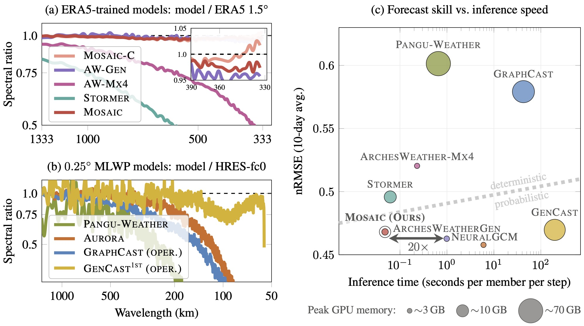
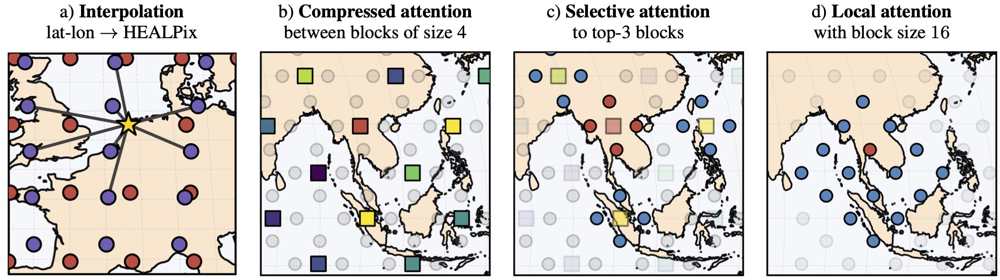
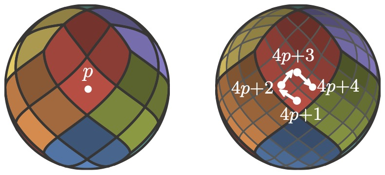
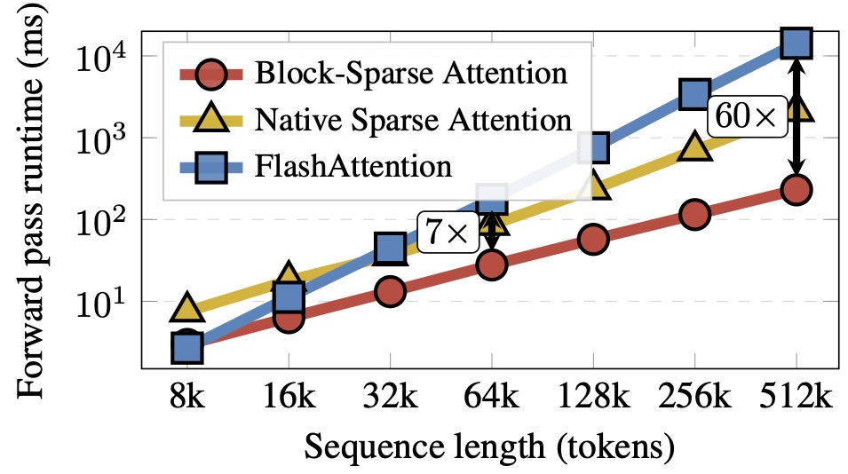
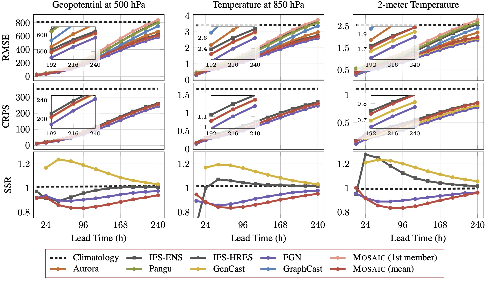
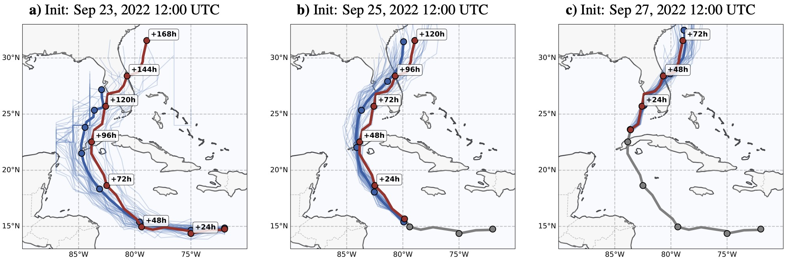

<p align="center">
  
</p>

# Mosaic — Block-Sparse Attention for Weather Forecasting

|  📄 [**Paper**](https://arxiv.org/abs/2604.16429)  |  🤗 [**Hugging Face**](https://huggingface.co/maxxxzdn/mosaic)  |  💻 [**GitHub**](https://github.com/maxxxzdn/mosaic)  |
| :---: | :---: | :---: |
| ICML 2026 · arXiv:2604.16429 | Pretrained weights & model card | Source code & issue tracker |

> **(Sparse) Attention to the Details: Preserving Spectral Fidelity in ML-based Weather Forecasting Models** \
> Maksim Zhdanov, Ana Lucic, Max Welling, Jan-Willem van de Meent · *ICML 2026*

**Mosaic** is a probabilistic weather forecasting model that operates on native-resolution grids via mesh-aligned block-sparse attention. At 1.5° resolution with 214M parameters, Mosaic matches or outperforms models trained on 6× finer resolution on key variables, and individual ensemble members exhibit near-perfect spectral alignment across all resolved frequencies. A 24-member, 10-day forecast takes under 12 s on a single H100 GPU.



## TL;DR

Mosaic addresses two distinct failure modes of spectral degradation in ML-based weather prediction:

1. **Spectral damping** caused by deterministic training against ensemble means. Mosaic addresses this with learned functional perturbations that produce ensemble members preserving realistic spectral variability.
2. **High-frequency aliasing** caused by compressive encoding onto a coarse latent grid. Mosaic operates at native resolution via block-sparse attention before any coarsening, eliminating the compress-first bottleneck.

The block-sparse attention captures long-range dependencies at **linear** cost by sharing keys and values across spatially adjacent queries arranged on the HEALPix mesh. Each query block jointly selects which key blocks to attend to.

## Published Variants

This repository ships **two trained variants**, distinguished primarily by the data they were tuned on. They share the same Mosaic architecture and 82-channel variable set, but differ in training data, time cadence, history length, and normalization statistics.

| Variant | Training data | Native step | Input history | k-neighbours | Suggested input zarr |
|---------|---------------|-------------|---------------|---------------|---------------------|
| `era5`  | ERA5 reanalysis only       | 24 h | 2 states (48 h) | 24 | WB2 ERA5 1.5° |
| `hres`  | ERA5 pretrain + HRES finetune | 6 h  | 4 states (24 h) | 20 | WB2 HRES-fc0 1.5° |

Choose `era5` when initializing from reanalysis (matches the training distribution); choose `hres` when initializing from HRES analysis or a similar operational state.

## Architecture

**Inputs.** 82 atmospheric channels at 1.5° equiangular resolution (240 lon × 121 lat = 29 040 points) plus 3 static channels and sinusoidal day/year time encodings.

**Backbone.** A U-Net of transformer blocks over the HEALPix mesh, where spatial neighbours occupy contiguous memory and queries can be grouped into hardware-aligned blocks:

| Stage      | Nside | Hidden dim | Heads | Enc / Dec depth |
|------------|------:|----------:|------:|----------------:|
| Stage 1    | 64    | 768       | 12    | 4 / 2 |
| Stage 2    | 32    | 1024      | 16    | 4 / 2 |
| Bottleneck | 16    | 1280      | 20    | 2     |

Grouped-Query Attention with ratio 4 (3 KV heads per stage), 2D RoPE on (longitude, latitude), and additive noise injection in SwiGLU gates for ensemble generation. ~214M parameters total.



**Block-sparse attention.** Three branches combined by learned gates: (i) **compression** — block-to-block coarse attention captures broad synoptic patterns at $\mathcal{O}(N^2/b^2)$; (ii) **selection** — each query block top-k-selects fine-scale key blocks at $\mathcal{O}(Nnb)$; (iii) **local** — full attention inside each block at $\mathcal{O}(Nb)$. Spatially close points occupy contiguous memory on the HEALPix mesh, enabling coalesced GPU reads and hardware-aligned block computation. Implemented as a single Triton kernel; in practice up to **61.8× faster than dense attention** and **9.4× faster than NSA**.

<p align="center">
  
  
</p>

### Variables (82 channels)

- **Surface (4):** `2m_temperature`, `10m_u_component_of_wind`, `10m_v_component_of_wind`, `mean_sea_level_pressure`
- **Pressure level (6 × 13 = 78):** `geopotential`, `specific_humidity`, `temperature`, `u_component_of_wind`, `v_component_of_wind`, `vertical_velocity` at levels [50, 100, 150, 200, 250, 300, 400, 500, 600, 700, 850, 925, 1000] hPa
- **Static (3, conditioning only — not in output):** `geopotential_at_surface`, `land_sea_mask`, `soil_type`

## Results

Headline plot is at the top of this page: individual ensemble members preserve realistic kinetic-energy spectra (left, 1.5°; centre, 0.25°), and Mosaic sits on the favourable end of the skill–speed–memory Pareto (right). All metrics computed at 240 h lead time, 720 initial conditions throughout the 2020 test year (1.5° benchmark) and a single 6 h forecast (0.25° benchmark).

On the 0.25° HRES benchmark, Mosaic competes with state-of-the-art 0.25° models despite operating at 1.5°:



And a case study of **Hurricane Ian (2022)** — Mosaic's ensemble correctly brackets the observed track 7 days ahead, with progressive narrowing of spread as lead time decreases:



See the paper for full benchmark tables, CRPS curves, and spread-to-skill ratios.

## Hardware Requirements

- **GPU:** any CUDA GPU; 16 GB is enough for a 1-member rollout, A100/H100 recommended for multi-member ensembles
- **Memory:** ~9 GB GPU RAM for a 1-member, 40-step (10-day) rollout in float16
- **Throughput:** 24-member, 10-day forecast in under 12 s on a single H100
- **CUDA:** 11.8+ with matching `triton` and `flash-attn` versions

## Installation

```bash
pip install -r requirements.txt
pip install flash-attn --no-build-isolation   # built separately; needs nvcc
```

For reading data from Google Cloud Storage (WeatherBench2 zarr stores):

```bash
pip install gcsfs
```

## Getting the weights

If you installed via Hugging Face (`huggingface-cli download maxxxzdn/mosaic --local-dir .`), the checkpoints (`checkpoints/era5_best.pt`, `checkpoints/hres_best.pt`) and normalization stats (`data/*.npz`) are already in place and `inference.py` finds them automatically.

If you cloned this repo from GitHub instead, the weights are not in the git tree (they live on the [Hugging Face mirror](https://huggingface.co/maxxxzdn/mosaic) as LFS objects). Fetch them with:

```bash
pip install huggingface_hub
huggingface-cli download maxxxzdn/mosaic --local-dir .   # pulls .pt + .npz assets
```

or programmatically:

```python
from huggingface_hub import snapshot_download
snapshot_download(repo_id="maxxxzdn/mosaic", local_dir=".")
```

## Quick Start

```bash
# ERA5 variant — 10-day forecast at 24 h resolution from ERA5 reanalysis
python inference.py --variant era5 \
    --zarr gs://weatherbench2/datasets/era5/1959-2023_01_10-6h-240x121_equiangular_with_poles_conservative.zarr \
    --init-time "2020-01-01T00:00" \
    --steps 10 --members 1 \
    --output forecast_era5.npz

# HRES variant — 10-day forecast at 6 h resolution from HRES initial conditions
python inference.py --variant hres \
    --zarr gs://weatherbench2/datasets/hres_t0/2016-2022-6h-240x121_equiangular_with_poles_conservative.zarr \
    --init-time "2022-01-01T00:00" \
    --steps 40 --members 1 \
    --output forecast_hres.npz

# Ensemble forecast (16 members) — change --members
python inference.py --variant hres --zarr <...> --init-time "2020-06-15T12:00" \
    --steps 40 --members 16 --output ensemble.npz
```

`--variant` selects the checkpoint, normalization statistics, history length, time stride, and neighbour count automatically. Pass `--checkpoint` or `--norm-stats` to override the bundled defaults.

## Output Format

The output `.npz` file contains:

| Array | Shape | Description |
|-------|-------|-------------|
| `forecasts` | `(members, steps, 240, 121, 82)` | Predicted states in physical units |
| `variables` | `(82,)` | Variable names |
| `lead_time_hours` | `(steps,)` | Lead times (era5: 24, 48, …; hres: 6, 12, …) |
| `init_time` | scalar | Initialization timestamp |
| `longitude` | `(240,)` | Longitude values (0 to 358.5°) |
| `latitude` | `(121,)` | Latitude values, South→North (−90 to 90°) |

### Reading the output

```python
import numpy as np

data = np.load("forecast_era5.npz", allow_pickle=True)
forecasts = data['forecasts']                          # (members, steps, 240, 121, 82)
variables = list(data['variables'])                    # ['2m_temperature', ...]
lead_hours = data['lead_time_hours']                   # e.g. [24, 48, ..., 240]

# Extract 500 hPa geopotential at 24 h lead time
z500_idx = variables.index('geopotential_500')
i_24h = int(np.where(lead_hours == 24)[0][0])
z500_24h = forecasts[0, i_24h, :, :, z500_idx]         # (240, 121) lon × lat
```

## Input Data Format

The model accepts ERA5 or HRES data in zarr format at 1.5° resolution with:

- **Grid:** 240 lon × 121 lat equiangular with poles
- **Time:** 6-hourly timesteps (integer hours since an arbitrary origin, parsed from the `units` zarr attribute, or as datetime64)
- **Variables:** all 10 atmospheric variables listed above; per-variable layout is auto-detected from `_ARRAY_DIMENSIONS` (either `(time, latitude, longitude)` or `(time, longitude, latitude)`), and latitude is flipped if stored North→South

Compatible zarr stores from [WeatherBench2](https://weatherbench2.readthedocs.io/):

```
gs://weatherbench2/datasets/era5/1959-2023_01_10-6h-240x121_equiangular_with_poles_conservative.zarr
gs://weatherbench2/datasets/hres_t0/2016-2022-6h-240x121_equiangular_with_poles_conservative.zarr
```

## Repository Contents

| File | Description |
|------|-------------|
| `inference.py` | Main inference script (variant-aware via `--variant {era5,hres}`) |
| `mosaic.py` | Mosaic U-Net transformer |
| `primitives.py` | Attention blocks, RoPE, HEALPix sampling, noise generator |
| `ops.py` | Triton block-sparse attention kernels |
| `utils.py` | HEALPix grid utilities |
| `base.py` | `WeatherModel` wrapper |
| `config.py` | Variable / level definitions |
| `dataset.py` | Metadata dataclasses |
| `data/norm_stats_era5.npz` | Normalization statistics for the `era5` variant |
| `data/norm_stats_hres.npz` | Normalization statistics for the `hres` variant |
| `data/static_vars.npz` | Static fields (orography, land–sea mask, soil type) — shared between variants |
| `checkpoints/era5_best.pt` | Trained checkpoint, `era5` variant (~1.7 GB) — Hugging Face only |
| `checkpoints/hres_best.pt` | Trained checkpoint, `hres` variant (~1.7 GB) — Hugging Face only |
| `figures_weather/` | Figures from the paper |

## Limitations

Mosaic operates at 1.5° (~166 km), which cannot resolve mesoscale phenomena such as tropical-cyclone inner-core structure or individual severe thunderstorms. The block-sparse attention is designed to scale linearly with sequence length, so finer grids (e.g. 0.25°, ~700k tokens) are a natural next step but are not part of this release.

## Model card metadata

|         |   |
|---------|---|
| License | [`cc-by-nc-4.0`](https://creativecommons.org/licenses/by-nc/4.0/) |
| Library | `pytorch` |
| Tags    | `weather` · `weather-forecasting` · `climate` · `atmospheric-science` · `sparse-attention` · `transformer` · `probabilistic-forecasting` |

## License

Released under [CC-BY-NC-4.0](https://creativecommons.org/licenses/by-nc/4.0/). Free for non-commercial research and educational use with attribution; commercial use requires a separate license. Underlying training data (ERA5, HRES) is subject to its own licensing terms set by ECMWF.

## Acknowledgements

MZ acknowledges support from Microsoft Research AI4Science. JWvdM acknowledges support from the European Union Horizon Framework Programme (Grant agreement ID: 101120237). This work used the Dutch national e-infrastructure with the support of the SURF Cooperative using grant no. EINF-16923. Computations were partially performed using the UvA/FNWI HPC Facility.

## Citation

If you use Mosaic, please cite:

```bibtex
@inproceedings{zhdanov2026mosaic,
  title     = {(Sparse) Attention to the Details: Preserving Spectral Fidelity in ML-based Weather Forecasting Models},
  author    = {Zhdanov, Maksim and Lucic, Ana and Welling, Max and van de Meent, Jan-Willem},
  booktitle = {Proceedings of the 43rd International Conference on Machine Learning (ICML)},
  year      = {2026},
  url       = {https://arxiv.org/abs/2604.16429}
}
```
